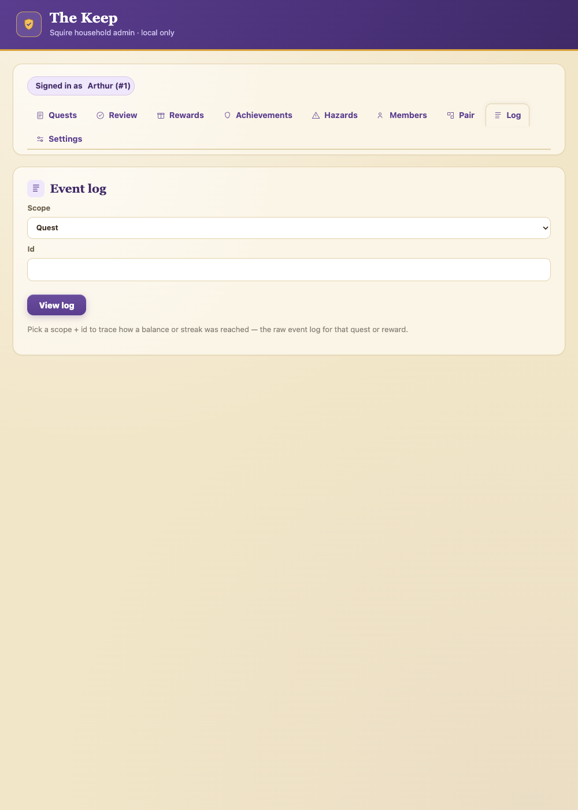

# How Squire works

Squire is built so that a child can act freely — even offline — while **only the parent's computer
can ever move a balance**. This isn't enforced by hiding buttons; it's true by construction. This
page explains the design behind that promise.

## One writer, many clients

The system is a set of cooperating clients around a single-writer core, separated by an
authenticated trust boundary:

- **The Keep** (home computer) holds the engine and the store. It is the *only* component that
  writes. Every state change goes through one engine "door" that validates and commits.
- **The Squire** (child phone) and **the Knight** (parent phone) are *clients*. They read state and
  submit proposals. Neither writes the store directly.

The child's network surface offers only **read + propose**. There is no "approve" or "mint" call
available to the Squire role at all — so the child app is *provably incapable* of granting itself
points, regardless of what's tapped on the phone.

## The review loop

```
Child (Squire)          Queue            Parent (Knight / Keep)
   "I did it"   ──────▶  claim   ──────▶  approve / reject
                                              │
                                              ▼
                                    Keep commits the reward
                                    (value snapshotted)
```

1. The child submits a **claim** (chore done) or a **redemption request** (wants a reward).
2. It lands in a single batched **review queue**.
3. A parent approves or rejects — from the Knight on their phone or from the Keep.
4. The Keep performs the write. Quests marked **auto-approve** skip the queue entirely, keeping daily
   parent effort to seconds.

Privileged parent actions (approve, redeem, add funds) ride a **per-user, tenant-scoped token** the
child never has. The integrity model rests on that token plus single-writer commit — not on secrecy.

## Everything is derived from an event log

Squire never stores a balance as a number it edits. Instead it keeps an **append-only event log**
(approvals `+`, redemptions `−`, bonuses `+`, adjustments `±`) and *derives* every balance, streak,
due-list, and unlock by replaying it.

This has real consequences for families:

- **Explainable.** Any balance or streak can be justified by replaying the events behind it — open
  the Log tab and see exactly how a number happened.

  

- **History never silently changes.** Reward values are snapshotted at approval, so editing a
  quest's payout later doesn't rewrite points already earned.
- **Archiving ≠ deleting.** Archiving a quest or reward hides it going forward while its history
  stays valid.
- **Restores are exact.** Re-importing the log reconstructs identical balances and streaks — which
  is why [backup & restore](../how-to/backup-restore.md) is trustworthy.

## Offline by design

Each phone caches the last state it saw and renders from that cache when the home computer is
unreachable. Claims, requests, and parent quick-actions queue in a local **outbox** and flush
**idempotently** (client-minted ids) when the device reconnects. The two devices never need to be
online at the same time: a child can finish a chore offline, and it appears in the parent's queue on
the next sync.

## Where the data lives

On *your* machine. The home server keeps everything in its data directory; there is no Squire cloud
in the loop. The optional [internet exposure](../how-to/cloudflare-tunnel.md) still routes to your
own home server — it changes how phones reach it, not where the data lives.
