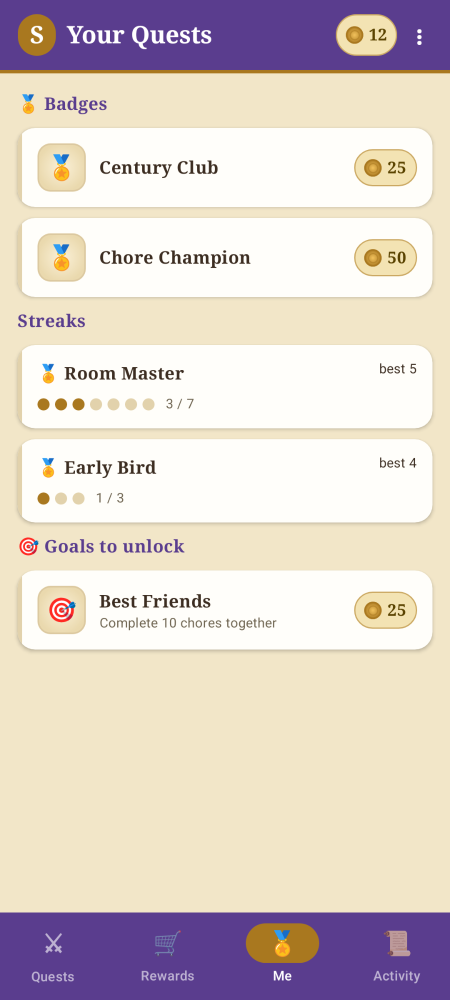
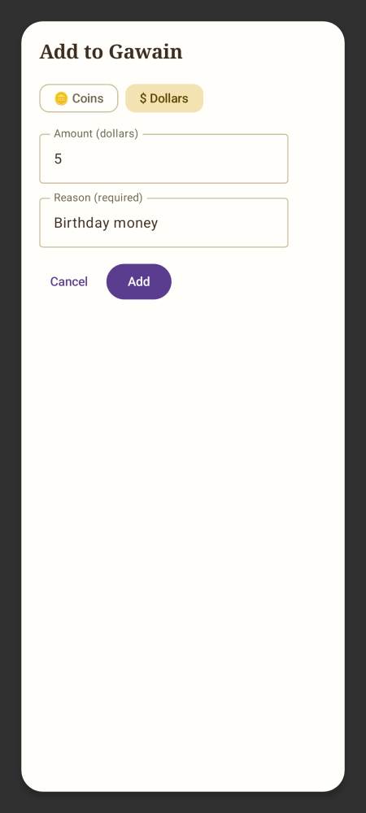

# Cash out a balance

Squire tracks two kinds of balance: **coins** (an in-app score) and **dollars** (real money you've
promised to pay). Cashing out is how a dollar balance becomes actual money handed to the child —
recorded so the ledger stays honest.

## How a child requests a cash-out

Cash-out is just a **redemption**, like any other reward. On the child's phone (the **Squire**),
open the rewards/profile screen, choose **Cash out**, and submit the amount.

The request lands in the parent review queue. Nothing is deducted yet — the dollars are only moved
when a parent approves.

## How a parent settles it

From the **Knight** app or the Keep's **Review** tab, approve the cash-out request. On approval:

- the child's dollar balance goes down by that amount,
- the event is written to the ledger (so the history explains the balance),
- you hand over the real money.

## Adding or correcting funds

Parents can also move a balance directly:

- **Add funds** — grant coins or dollars (for example, a one-off bonus).

  

- **Adjust** — a manual correction in either direction. Adjustments **require a reason**, which is
  recorded in the log.

## Why it's tracked this way

Every move — earn, spend, cash-out, adjustment — is an event in an append-only log. The balance is
*derived* from that log, never edited in place, so any number on screen can be explained by replaying
its history. See [How Squire works](../explanation/how-squire-works.md).
