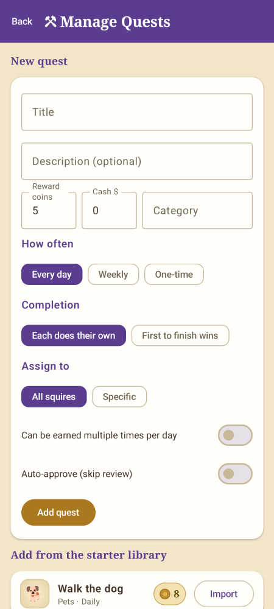

# Create chores & rewards

Authoring is keyboard-first and lives in the **Keep**. This guide covers the three things you'll
create most: quests (chores), rewards, and achievements. Parents can also do quick authoring from
the **Knight** app.

## Quests (chores)

A **quest** is a chore that pays out when completed and approved.

In the Keep's **Quests** tab, create a quest with:

- **Title** — what to do ("Make your bed").
- **Assignee** — which Squire(s) it's for.
- **Cadence** — one-off, **Daily**, **Weekly** (pick the days), or **Every N days**.
- **Reward** — what completing it pays: coins, real dollars, or both
  ([Squire supports multiple currencies](../reference/glossary.md#currency)).
- **Auto-approve** — on for trivial chores (the point lands without review); off to route it through
  the [review queue](../explanation/how-squire-works.md#the-review-loop).

> **Editing is safe for history.** Reward values are snapshotted when a completion is approved, so
> changing a quest's payout later never rewrites points already earned. Archiving a quest hides it
> going forward without deleting its history.

From the phone, a parent can author quests in the **Knight** app's Manage screen:

### Starter library

Don't author from scratch — the Quests tab has a **starter library** you can one-tap import and then
tweak.

## Rewards

A **reward** is something a child spends their balance on. In the **Rewards** tab set:

- **Name** and **cost** (in coins and/or dollars),
- **Availability** — *Once* or *Repeatable*,
- an optional **achievement gate** so a reward only unlocks after an achievement is earned.

Points are only checked at the moment of redemption — nothing is reserved while a request is
pending.

## Achievements

**Achievements** reward consistency rather than a single chore: streaks (e.g. *7 days in a row*),
totals, or point milestones. Earning one is sticky, can award bonus points, and can unlock gated
rewards. Create them in the Keep's **Achievements** tab.

## Hazards

Squire also supports **hazards** — negative behaviors that *deduct* coins or progress — for when you
want consequences as well as rewards. Configure them alongside your quests in the Keep.

## See also

- [Cash out a balance](cash-out.md) — turning a dollar balance into real money.
- [How Squire works](../explanation/how-squire-works.md) — why the child can never self-approve.
