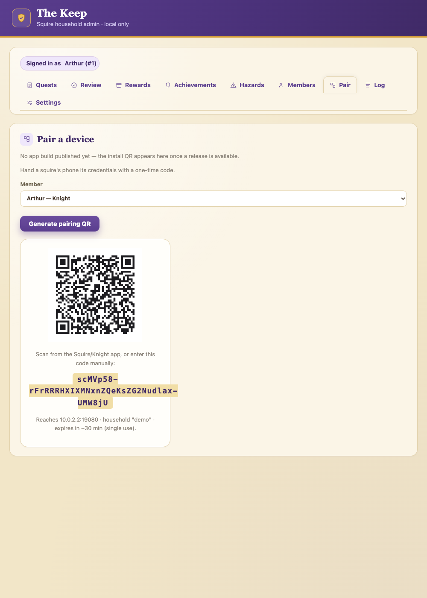

# Pair a phone

Pairing links a phone to a specific household member and gives it that member's role. A child's
phone paired to a Squire account becomes **the Squire** (player); a parent's phone paired to a
Knight account becomes **the Knight** (quick-admin). The role and its permissions come from the
account, not the app — the child app never holds a parent credential.

You only pair once per phone.

## Steps

1. **Install the app first** if you haven't — [Install the app](install-app.md).
2. In the **Keep**, open the **Pair** tab and choose the member this phone belongs to. Mint a
   one-time pairing code; the Keep shows it as a QR code (and as text).

   

3. On the phone, open Squire and tap **Scan to pair**. Point it at the QR.
4. The phone discovers the home server on the LAN, redeems the code, and stores its own secure
   token. Done — it opens straight into the right role.

## Good to know

- **Pairing codes are one-time and short-lived.** If a code expires before you scan it, just mint a
  new one.
- **Re-pairing** a phone (new device, or wiped app) is the same flow — mint a fresh code.
- **Same Wi‑Fi required** for pairing, because the phone finds the server over the LAN. To use a
  phone away from home afterward, set up [internet access](cloudflare-tunnel.md).

## Troubleshooting

| Symptom | Fix |
|---------|-----|
| Phone can't find the server | Confirm both devices are on the same Wi‑Fi and the server is running. mDNS must not be disabled (`SQUIRE_MDNS` is on by default — see [configuration](../reference/configuration.md)). |
| "Code invalid or expired" | Mint a new code in the Pair tab and scan promptly. |
| Wrong role after pairing | You paired to the wrong account. Re-pair using a code minted for the correct member. |
