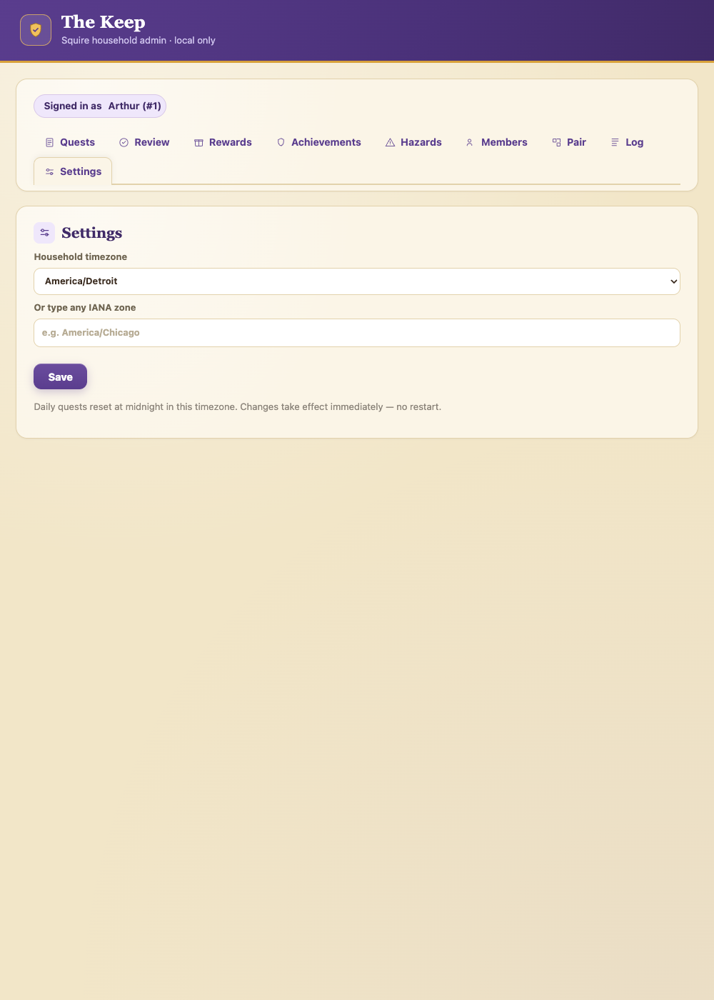

# Server configuration

`squire-serve` is configured entirely through environment variables — no config file. This is the
authoritative list, sourced from the server binary
(`crates/squire-home/src/bin/squire-serve.rs`).

## Ports & data

| Variable | Default | Purpose |
|----------|---------|---------|
| `API_PORT` | `8080` | Local API the phones connect to. |
| `KEEP_PORT` | `4920` | The Keep (parent admin web UI). |
| `SQUIRE_DATA_DIR` | OS data dir (`…/squire`) | Durable data directory. Everything persists here. |
| `SQUIRE_HOUSEHOLD` | `home` | Tenant handle for this household. |

## First-run admin

| Variable | Default | Purpose |
|----------|---------|---------|
| `SQUIRE_ADMIN_NAME` | — | Display name of the first admin Knight, created on first run. |
| `SQUIRE_ADMIN_SECRET` | — | First admin's login secret. **Optional** — omit both to create the admin from the Keep's first-run form instead. Ignored after the household exists. |

> First-run admin variables only take effect when the data dir is empty. On later starts the server
> opens the existing household untouched.

## App distribution & updates

| Variable | Default | Purpose |
|----------|---------|---------|
| `SQUIRE_APK_DIR` | `<data_dir>/updates` | Where the OTA phone-app builds are stored and served from. |
| `SQUIRE_APK_SYNC` | on | Background pull of the latest phone APK from the public dist repo. Set `off` to disable. |
| `SQUIRE_DIST_REPO` | `colliery-io/squire` | The public release repo to pull the app + server updates from (`owner/name`). |
| `SQUIRE_SELF_UPDATE` | on | Server self-update from the dist repo on start. Set `off` to disable. |
| `SQUIRE_UPDATE_TOKEN` | — | GitHub token for the update/APK-sync API calls, to avoid unauthenticated rate limits. |

## Network & discovery

| Variable | Default | Purpose |
|----------|---------|---------|
| `SQUIRE_MDNS` | on | Advertise `_squire._tcp` on the LAN so phones discover the server. Set `off` for internet-only deployments. |
| `SQUIRE_PAIR_HOST` / `SQUIRE_PAIR_PORT` | — | Override the host/port encoded into pairing QR codes (e.g. when behind a tunnel). |
| `SQUIRE_SIGNING_KEY` | persisted | Override the persisted token-signing key. Normally generated once and stored. |
| `SQUIRE_TZ` | host zone | Household timezone seed on first run (also settable in the Keep's Settings tab). |

The Keep's **Settings** tab exposes the live household timezone (and other per-household settings)
without touching the environment:



## Example

```sh
SQUIRE_DATA_DIR=/var/lib/squire \
SQUIRE_HOUSEHOLD=ourhouse \
API_PORT=8080 KEEP_PORT=4920 \
SQUIRE_ADMIN_NAME="Mom" SQUIRE_ADMIN_SECRET="…" \
squire-serve
```

> Some variables (`SQUIRE_MDNS=off`, `SQUIRE_PAIR_HOST`) matter mainly for the planned
> [internet-mode deployment](../how-to/cloudflare-tunnel.md).
