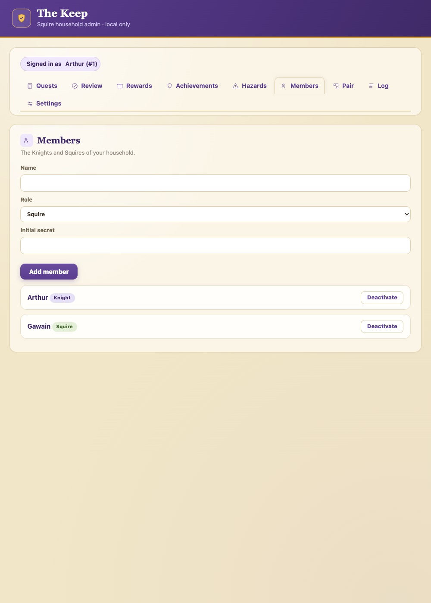
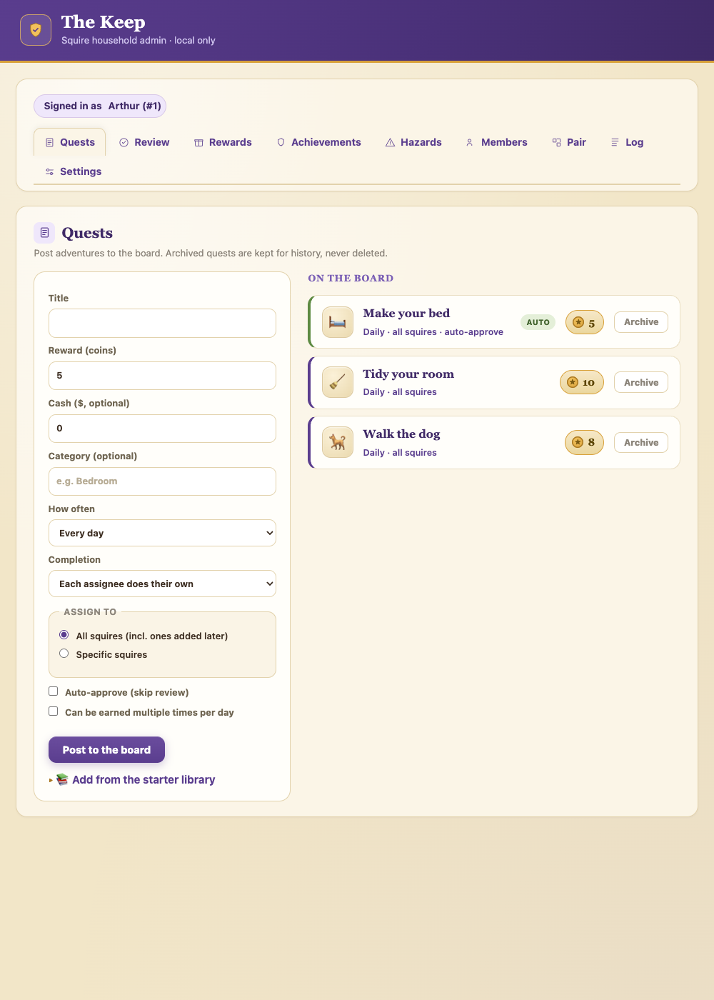
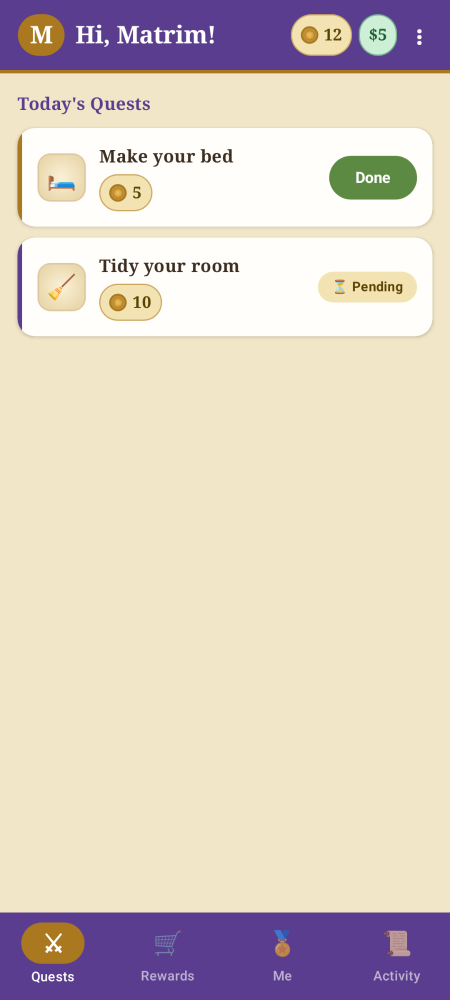
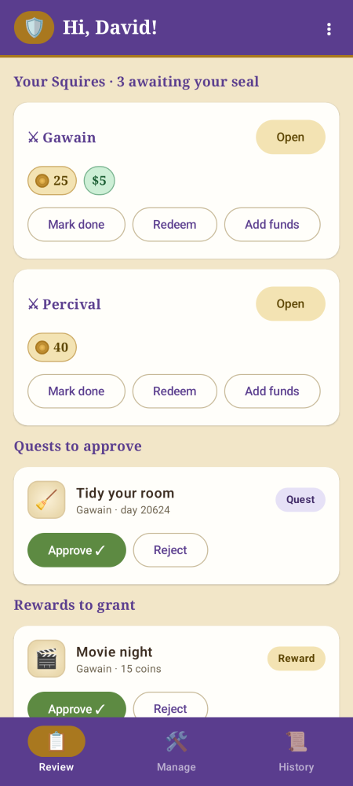
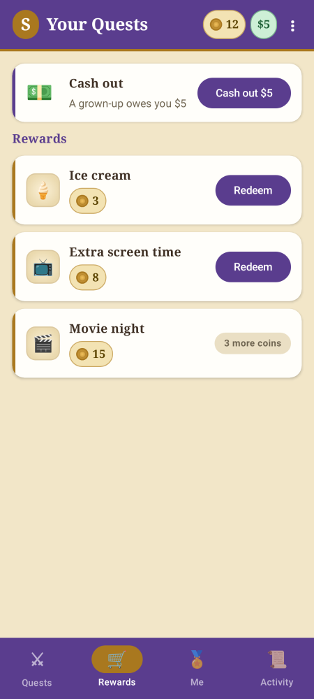

# Set up Squire for your family

This tutorial takes you from nothing to a working household: the home server running, the Keep open,
your kids' phones paired, and a first chore that pays out a reward. Allow about 20 minutes.

> **Before you start** you need the **home server** running on a computer in your house. If that's
> not done yet, follow [Stand up a home server](self-host-setup.md) first (or hand this section to
> whoever runs it), then come back here.

## 1. Open the Keep

On the home computer, open the **Keep** — the parent admin app — in a browser at
`http://localhost:4920`. On first run it asks you to create the first admin (a **Knight**). Pick a
name and a secret you'll remember; this is the parent login.

## 2. Add your household members

Go to the **Members** tab and add each person:

- a **Knight** for each parent who'll review and approve,
- a **Squire** for each child who'll play.

## 3. Create a first chore

Open the **Quests** tab and create a quest — say *"Make your bed"*, daily, worth a few coins,
assigned to your child. (Full options are covered in
[Create chores & rewards](../how-to/chores-and-rewards.md).)

Add at least one **reward** in the Rewards tab too, so there's something to spend coins on.

## 4. Pair the kids' phones

Each phone pairs once. Briefly: in the Keep's **Pair** tab, mint a code and show its QR; on the
phone, install the app and scan it. The full walkthrough is
[Install the app](../how-to/install-app.md) → [Pair a phone](../how-to/pair-phone.md).

Pair a child's phone as a **Squire** and a parent's phone as a **Knight**.

## 5. Play one full loop

1. On the child's phone (the **Squire**), tap the quest and submit **"I did it"**.

   

2. On a parent's phone (the **Knight**) — or in the Keep — the claim appears in the review queue.
   Approve it.

   

3. The child's balance goes up. They can now spend it in the
   [reward store](../how-to/cash-out.md).

   

That's the whole rhythm of Squire: the child proposes, the parent approves, the balance moves. From
here:

- Add more quests, rewards, and **achievements** — [Create chores & rewards](../how-to/chores-and-rewards.md).
- Let kids trade real money out — [Cash out a balance](../how-to/cash-out.md).
- Understand why only the parent can move points — [How Squire works](../explanation/how-squire-works.md).
